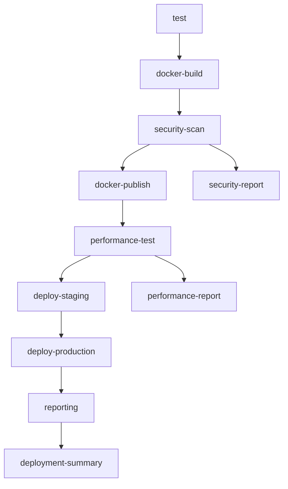

# GitHub Actions Enhancements Design Document

## Overview

This design extends the existing GitHub Actions CI/CD pipeline with advanced DevOps capabilities including Docker Hub publishing, security scanning, performance monitoring, comprehensive reporting, and environment-specific deployments. The enhanced workflow will provide production-ready automation while maintaining the existing test and build functionality.

## Architecture

### Workflow Structure
```
Existing Jobs:
├── test (Node.js testing & linting)
├── docker-build (Local Docker build & test)

New Enhanced Jobs:
├── security-scan (Vulnerability scanning)
├── docker-publish (Docker Hub publishing)
├── performance-test (Load testing & monitoring)
├── deploy-staging (Staging environment deployment)
├── deploy-production (Production deployment with approval)
└── reporting (Comprehensive reporting & notifications)
```

### Job Dependencies


## Components and Interfaces

### 1. Docker Hub Publishing Component

**Purpose**: Automate container image publishing to Docker Hub registry

**Implementation**:
- Uses `docker/login-action@v3` for secure authentication
- Implements multi-tag strategy (latest, SHA, version)
- Includes image verification and manifest inspection
- Provides rollback capability for failed publishes

**Configuration**:
```yaml
docker-publish:
  needs: [docker-build, security-scan]
  runs-on: ubuntu-latest
  if: github.event_name == 'push' && github.ref == 'refs/heads/main'
```

**Secrets Required**:
- `DOCKER_HUB_USERNAME`: Docker Hub username
- `DOCKER_HUB_ACCESS_TOKEN`: Docker Hub access token

### 2. Security Scanning Component

**Purpose**: Automated vulnerability detection for code and containers

**Tools Integration**:
- **Trivy**: Container image vulnerability scanning
- **CodeQL**: Static code analysis for security issues
- **npm audit**: Node.js dependency vulnerability checking

**Implementation**:
- Parallel scanning for faster execution
- Configurable severity thresholds
- SARIF report generation for GitHub Security tab
- Artifact storage for scan results

### 3. Performance Monitoring Component

**Purpose**: Application performance validation during deployment

**Metrics Collected**:
- Application startup time
- HTTP response times (p50, p95, p99)
- Memory and CPU usage
- Concurrent user handling capacity

**Tools**:
- **Artillery.js**: Load testing framework
- **Docker stats**: Resource monitoring
- Custom performance thresholds validation

### 4. Environment Management Component

**Purpose**: Multi-environment deployment with proper isolation

**Environments**:
- **Staging**: Automatic deployment from main branch
- **Production**: Manual approval required

**Features**:
- Environment-specific secrets and configurations
- Separate Docker image tags per environment
- Environment health checks and rollback capabilities

### 5. Reporting and Notification Component

**Purpose**: Comprehensive workflow reporting and team notifications

**Artifacts Generated**:
- Build and test reports
- Security scan results
- Performance test results
- Deployment manifests and logs

**Notification Channels**:
- GitHub commit status updates
- Workflow summary comments on PRs
- Optional Slack/Teams integration

## Data Models

### Workflow Context Data
```yaml
workflow_context:
  commit_sha: string
  branch_name: string
  environment: string (staging|production)
  image_tags: array[string]
  deployment_timestamp: datetime
```

### Security Scan Results
```yaml
security_results:
  vulnerabilities:
    critical: number
    high: number
    medium: number
    low: number
  scan_duration: number
  tools_used: array[string]
  sarif_report_path: string
```

### Performance Metrics
```yaml
performance_metrics:
  startup_time_ms: number
  response_times:
    p50: number
    p95: number
    p99: number
  resource_usage:
    memory_mb: number
    cpu_percent: number
  load_test_results:
    requests_per_second: number
    error_rate_percent: number
```

## Error Handling

### Security Scan Failures
- Critical vulnerabilities fail the workflow
- Generate detailed security reports
- Provide remediation suggestions
- Allow security override with manual approval

### Docker Hub Publishing Failures
- Retry mechanism with exponential backoff
- Fallback to local registry for testing
- Clear error messaging with troubleshooting steps
- Maintain deployment capability without publishing

### Performance Test Failures
- Configurable performance thresholds
- Detailed performance reports with recommendations
- Option to proceed with warnings for non-critical metrics
- Historical performance trend analysis

### Environment Deployment Failures
- Automatic rollback to previous version
- Environment health check validation
- Detailed failure analysis and logging
- Emergency deployment bypass procedures

## Testing Strategy

### Unit Testing
- Workflow YAML syntax validation
- Action parameter validation
- Secret and environment variable testing

### Integration Testing
- End-to-end workflow execution
- Multi-environment deployment testing
- Security scan integration validation
- Performance monitoring accuracy

### Security Testing
- Vulnerability detection accuracy
- False positive rate analysis
- Security threshold enforcement
- SARIF report format validation

### Performance Testing
- Load test scenario validation
- Resource monitoring accuracy
- Threshold enforcement testing
- Performance regression detection

## Configuration Management

### Environment Variables
```yaml
env:
  NODE_VERSION: "18"
  IMAGE_NAME: nodejs-demo-app
  DOCKER_REGISTRY: docker.io
  STAGING_URL: https://staging.example.com
  PRODUCTION_URL: https://production.example.com
  PERFORMANCE_THRESHOLD_MS: 500
  SECURITY_SEVERITY_THRESHOLD: high
```

### Secrets Management
- Docker Hub credentials
- Environment-specific deployment keys
- Notification service tokens
- Security scanning API keys

### Feature Flags
- Enable/disable security scanning
- Enable/disable performance testing
- Enable/disable Docker Hub publishing
- Enable/disable notifications

## Deployment Strategy

### Staging Environment
- Automatic deployment on main branch push
- Full integration testing suite
- Performance baseline establishment
- Security validation

### Production Environment
- Manual approval gate
- Blue-green deployment strategy
- Health check validation
- Automatic rollback on failure

### Rollback Procedures
- Previous image tag restoration
- Database migration rollback (if applicable)
- Configuration rollback
- Traffic routing restoration